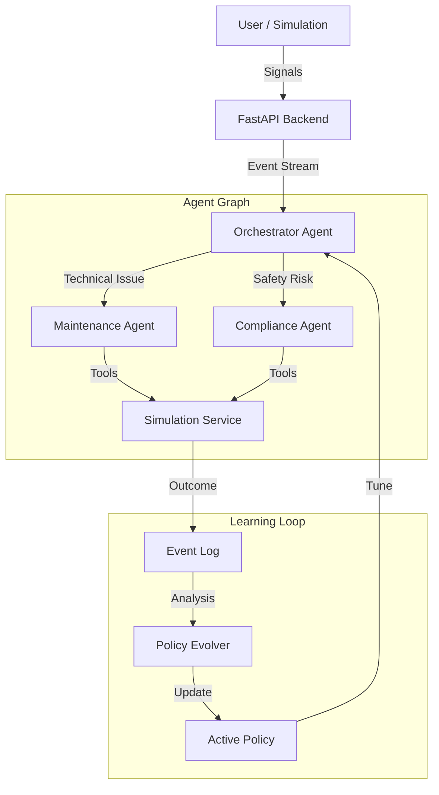

# LineWatch AI - Autonomous Industrial Shift Intelligence

[](https://www.python.org/)
[](https://fastapi.tiangolo.com/)
[](https://reactjs.org/)
[](https://langchain-ai.github.io/langgraph/)

**LineWatch AI** is a multi-agent system designed to autonomously manage a simulated factory floor. It moves beyond simple anomaly detection by employing cognitive agents that investigate root causes, dispatch maintenance crews, and enforce safety compliance—all while "learning" from their decisions to improve future performance.

---

## 🚀 Key Features

### 1. Autonomous Agents
The system is governed by a graph of specialized AI agents:
- **Orchestrator**: The "Plant Manager" that triages incoming signals.
- **Maintenance Agent**: Diagnoses equipment failures and dispatches mechanics.
- **Compliance Agent**: Monitors safety feeds and halts production for violations.

### 2. "Fog of War" Simulation
Unlike traditional demos, the AI **does not have god-mode access**.
- Agents can only "see" what constitutes a valid camera feed.
- Blind spots exist. Agents must **install new cameras** or **dispatch supervisors** to investigate effectively.

### 3. Active Learning (Self-Evolution)
The system tracks its own decision outcomes (Success vs. Failure).
- If it escalates too many false alarms, it autonomously raises its **Confidence Threshold**.
- If it misses safety incidents, it increases the weight of its **FMEA (Failure Mode)** reasoning model.
- *See [ACTIVE_LEARNING.md](./ACTIVE_LEARNING.md) for the deep dive.*

### 4. Real-Time Persistence
- **Session Persistence**: Stop and resume without losing inventory or machine health.
- **Rate Limiting**: Includes robust protection against API abuse (5 faults/day per user).

---

## 🛠️ Installation & Setup

### Prerequisites
- Python 3.10+
- Node.js 16+
- Google Gemini API Key

### Backend Setup
1. Navigate to the backend directory:
   ```bash
   cd linewatch-ai-backend
   ```
2. Create virtual environment and install dependencies:
   ```bash
   python -m venv .venv
   .venv\Scripts\activate
   pip install -r requirements.txt
   ```
3. Configure environment variables (`.env`):
   ```env
   GOOGLE_API_KEY=your_key_here
   ```
4. Start the server:
   ```bash
   start_server.bat
   ```
   *Server runs on `http://localhost:8000`*

### Frontend Setup
1. Navigate to the frontend directory:
   ```bash
   cd linewatch-ai
   ```
2. Install dependencies:
   ```bash
   npm install
   ```
3. Start the development server:
   ```bash
   npm run dev
   ```
   *UI runs on `http://localhost:5173`*

---

## 🏗️ Architecture



## 🤝 Usage Guide

1. **Start Simulation**: Click "Start" in the header.
2. **Observe**: Watch agents patrol the map. Cameras will turn yellow/red upon detection.
3. **Interact**:
   - **Inject Fault**: Trigger a breakdown via the "Inject Fault" button (Max 5/day).
   - **Challenge**: Watch the agent identify weaknesses in camera coverage and employ work orders for more cameras when needed.
   - **Verify**: Watch the Maintenace Crew (orange dot) physically move to repair broken lines.

## 📄 License
Private Hackathon Project. All rights reserved.
